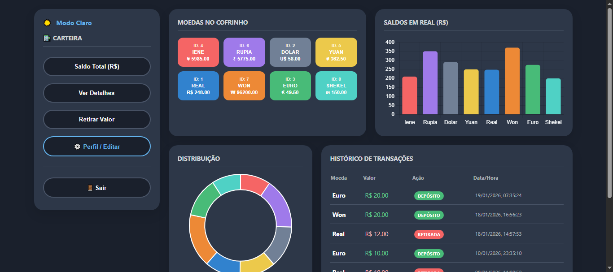
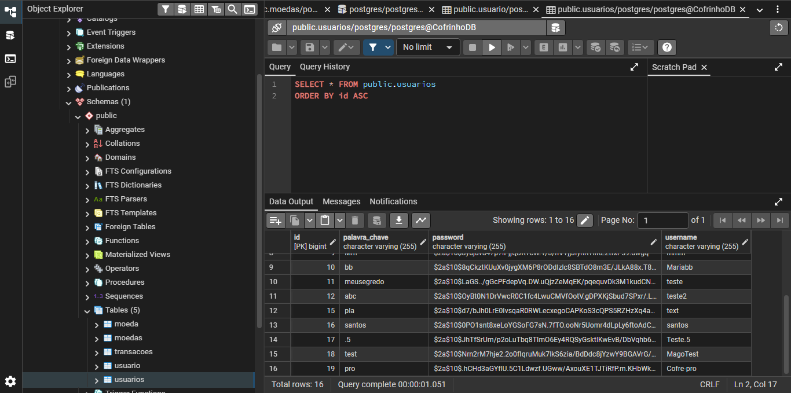

# 💰 Cofrinho Pro - Dashboard Financeiro Multi-Moedas

O **Cofrinho Pro** é um sistema de gestão de economias que permite o controle de saldos em diversas moedas internacionais, com conversão automática e visualização de dados em tempo real através de gráficos dinâmicos.

---

## 🧬 Diferenciais Técnicos (Arquitetura)

Este projeto foi desenvolvido utilizando o **Java 25**, aplicando conceitos avançados de Engenharia de Software:

- **Herança e Polimorfismo**: Utiliza a estratégia *Single Table Inheritance* do JPA. Uma classe base `Moeda` gerencia o estado, enquanto subclasses (`Dolar`, `Euro`, `Iene`, etc.) implementam suas próprias regras de conversão.
- **Segurança Robusta**: Senhas protegidas com `BCrypt` e controle de acesso via `Spring Security` com `CustomUserDetailsService`.
- **Persistência Relacional**: Banco de dados PostgreSQL com histórico de transações vinculado para auditoria financeira.

---

## ✨ Funcionalidades

* **Gestão de Moedas**: Depósito e retirada de valores com IDs únicos por moeda.
* **Conversão Automática**: Exibição do valor na moeda original e o equivalente em Real (R$).
* **Dashboard Visual**: Gráficos de barras e rosca (**Chart.js**) para análise de distribuição de patrimônio.
* **Histórico de Transações**: Registro detalhado de todas as operações de depósito e retirada.
* **Gestão de Perfil**: Cadastro, edição de credenciais e exclusão permanente de conta.
* **UX Avançada**: Atalhos de teclado (Enter), efeitos dinâmicos e suporte a **Modo Escuro/Claro**.

---

## 🖼️ Visual do Sistema

### Dashboard Principal

*Interface com conversão de moedas em tempo real e gráficos dinâmicos.*

### Persistência de Dados

*Estrutura de tabelas e logs de auditoria armazenados no PostgreSQL.*

---

## 🛠️ Tecnologias Utilizadas

* **Backend**: Java 25, Spring Boot 3.x, Spring Data JPA.
* **Frontend**: HTML5, CSS3 (Variáveis Modernas), JavaScript Vanilla, Thymeleaf.
* **Banco de Dados**: PostgreSQL.
* **Segurança**: Spring Security + BCrypt.

---

## ⚙️ Como Rodar o Projeto

1.  **Configurar o Banco de Dados**:
    * Certifique-se de ter o PostgreSQL instalado.
    * Crie um banco chamado `postgres` (ou o nome definido no seu `application.properties`).
2.  **Configurar o `application.properties`**:
    * Ajuste as credenciais de `username` e `password` do seu banco local.
3.  **Executar a Aplicação**:
    * Rode a classe `CofrinhoApiApplication` através do IntelliJ ou via terminal: `./mvnw spring-boot:run`
4.  **Acesso**:
    * Abra o navegador em `http://localhost:8080/login`.
    **usuário**: `Cofre-pro`
    **Senha**: `1500`

> **Dica para Teste**: Cadastre-se na primeira execução ou use o usuário criado durante o setup para explorar o dashboard.

---

## 🗺️ Roadmap de Evolução

1.  **Integração com API de Câmbio**: Atualização das taxas (Dólar, Euro, etc.) via API externa em tempo real.
2.  **Dashboard de Metas**: Sistema de progresso para objetivos de economia (ex: "Viagem").
3.  **Exportação de Relatórios**: Geração de extratos mensais em PDF.

---
**Desenvolvido por Magno.**
